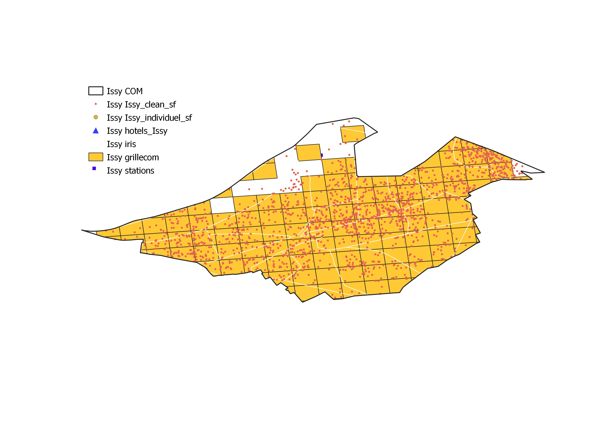

<br>

# Informations générales

## Accès

L'accès aux données AirDNA a fait l'objet d'une convention entre l'UMS RIATE et AirDNA dans le cadre de l'ANR WIsDHoM (Wealth inequalities and the dynamics of housing markets). Elles ne peuvent en conséquence pas être distribuées.

Les scripts ici proposés reposent sur des extractions réalisées à la commune par AirDNA. Cela signifie qu'ils peuvent être rejoués à l'identique à partir du moment où ces données sont mises à disposition par AirDNA, et que le modèle d'extraction de données d'AirDNA reste inchangé. 

L'extraction porte sur les limites communales de Bagneux, Issy-les-Moulineaux et Pantin. 

<br>


## Date de création des jeux de données consolidées

Juillet 2021 (dernière version)


<br>

## Date des métadonnées

Septembre 2021.


<br>

## Points de contact

- Nom : Louis Laurian
- Role : Point of contact
- Organisation : UMS RIATE, Université de Paris
- email : laurian.louis@gmail.com

<br>

- Nom : Ronan Ysebaert
- Role : Custodian
- Organisation : UMS RIATE, Université de Paris
- email : ronan.ysebaert@cnrs.fr

<br>

- Nom : Marianne Guérois
- Role : Custodian
- Organisation : UMS RIATE, Université de Paris
- email : marianne.guerois@u-paris.fr

<br>

- Nom : Malika Madelin
- Role : Custodian
- Organisation : UMR PRODIG, Université de Paris
- email : malika.madelin@u-paris.fr

<br>


## Citer ce travail

"Laurian Louis, 2021, Mise en oeuvre d’une chaîne de traitement de données AirDNA : Étudier l’activité de la plateforme Airbnb dans 3 communes franciliennes, UMS RIATE, ANR WIsDHoM, mémoire de stage de master Géoprisme". 

<br><br>


# Description des données mobilisées

Ce travail porte sur l'emprise géographique de trois communes franciliennes : Bagneux, Issy-les-Moulineaux et Pantin. 

## Données brutes

### AirDNA

Les variables des tableaux de données distribués par AirDNA. Pour un descriptif détaillé de ce contenu, se rendre dans la partie de préparation des données. 

```{r, echo = FALSE, message=FALSE, warning=FALSE}
library(readr)
library(readxl)
library(dplyr)
library(kableExtra)
# Tableaux descriptifs des variables
Descr_individuel <- read_delim("meta/Descr_individuel.csv", 
    ";", escape_double = FALSE, trim_ws = TRUE)
Descr_mensuel <- read_delim("meta/Descr_mensuel.csv", 
    ";", escape_double = FALSE, trim_ws = TRUE)
```


Les tableaux de données **mensuel** contiennent les bilans mensuels des scraping. Cette base de données indique les mois durant lesquels chaque logement a été scrapé ainsi que les bilans en terme de fréquentation et de revenus engendrés durant le mois scrapé, de janvier 2015 à décembre 2020. 

```{r, echo = FALSE}
kable(Descr_mensuel) %>% kable_paper()
```

La base de données **individuelle** est plus détaillée et est individuelle à chaque logement Airbnb. En effet, on a 70 variables décrivant la totalité des logements présents dans la commune depuis le début de leur mise en ligne sur le marché : chaque ligne représente un logement actif entre 2015 et 2020. On a donc pour certains d'entre eux des logements qui ne sont plus actifs voire qui ont été retirés du marché.

```{r, echo = FALSE}
kable(Descr_individuel) %>% kable_paper()
```

<br>


### INSEE

- [Hôtels](https://www.insee.fr/fr/statistiques/4489915)
- [Grille de 200 mètres](https://www.insee.fr/fr/statistiques/4176290?sommaire=4176305)

<br>

### Plateforme Data Ile-de-France

- [Stations de transport en Ile-de-France](https://data.iledefrance.fr/explore/dataset/gares-et-stations-du-reseau-ferre-dile-de-france-donnee-generalisee/information/ <https://data.iledefrance.fr/explore/dataset/gares-et-stations-du-reseau-ferre-dile-de-france-donnee-generalisee/information/) du réseau Ile-de-France 
- [Contours IRIS](https://data.iledefrance.fr/explore/dataset/iris/information/ <https://data.iledefrance.fr/explore/dataset/iris/information/>). 
- [Nombre de logements par commune](https://data.iledefrance.fr/explore/dataset/nombre-de-logements-totaux-des-communes-dile-de-france-donnee-insee/information/)


<br>


## Données consolidées

La phase de préparation et nettoyage des données mobilises les données brutes et restitue des données consolidées, utilisées dans les analyses. 


### AirDNA

Indicateurs utiles pour rejouer les analyses (synthèse et comparaisons de communes à communes). Un fichier par commune. 

```{r, echo = FALSE}
newvar <- read_xls("meta/newvar.xls")
kable(newvar) %>% kable_paper()
```

<br>

### Couches géographiques

Un geopackage par commune qui contient les couches géographiques suivantes :

- Espace d'étude : Limites géographiques de la commune (Polygone).
- Données consolidées mensuelles, géoréférencées (Points).
- Données consolidées individuelles, géoréférencées (Points).
- Carreaux de grille de 200 mètres intersectant l'espace d'étude (Polygones).
- Hôtels localisés dans la commune (Points).
- IRIS intersectant l'espace d'étude (Polygones).
- Stations de transports localisées dans la commune (Points).



# Session Info 

Packages R mobilisés pour préparer les données et construire les analyses. 

```{r}
sessionInfo()
```
